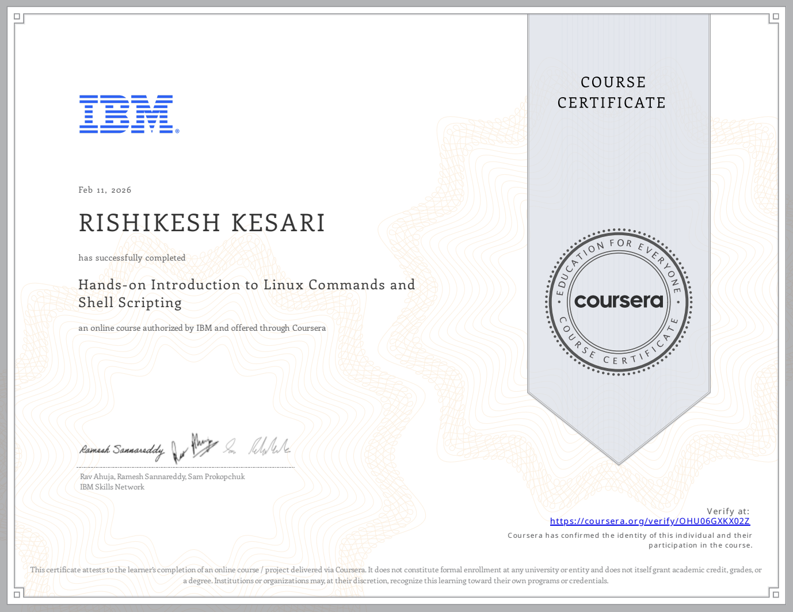
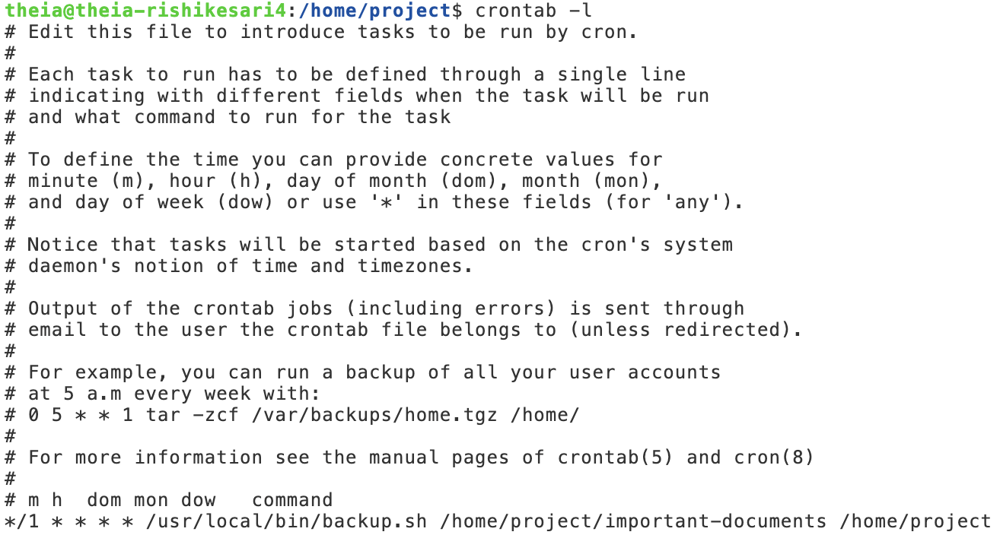
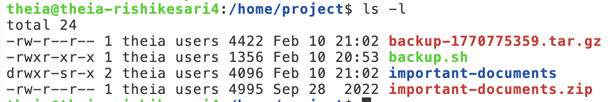

# Linux Commands and Shell Scripting
[](https://rishi-analytics.github.io/)


<p id="PySpark_Certificate" align="center">

</p>

Hands on experience in using Linux commands and shell scripting for file handling, batch operation, and workflow automation.
## Overview

This repository demonstrates foundational Linux command line and Bash scripting skills applied to a real-world automation scenario.

The core project implements an automated backup system that identifies files modified within the last 24 hours, archives them, and schedules execution using cron.

---

## Business Scenario

A company requires daily backups of sensitive files updated within the last 24 hours. Manual execution introduces:

- Human error
- Security risks
- Operational inefficiency

This project automates the process using Bash scripting and system scheduling.

---

## Core Project: Automated Backup Script

The script:

- Accepts source and destination directories as arguments
- Computes Unix timestamps for time comparison
- Identifies files modified within the last 24 hours
- Archives and compresses them using tar
- Supports scheduling via cron
- Can be installed system-wide in `/usr/local/bin`

---

## Technologies Used

- Linux CLI
- Bash
- Unix timestamps
- Arrays
- File permissions
- tar
- Cron scheduling

---

## How to Run

### Make the script executable
```
chmod +x backup.sh
```

Run manually: 

```
./backup.sh <source_directory> <destination_directory>
```

Install system wide:

```
sudo cp backup.sh /usr/local/bin/
```

Schedule with cron (daily at 2 AM):

```
0 2 * * * /usr/local/bin/backup.sh /source /destination
```
Sample Output
Example backup file created:

```backup-1700000000.tar.gz```


---

## Project Execution Images

### Backup Script Implementation

<p align="center">
  
  
</p>

### Cron Job Execution



### Generated Backup File



---

## Key Learnings (Data & Process Automation Perspective)

What I did? – I implemented a Bash script that automates daily backups by detecting files modified within the last 24 hours using Unix timestamps, arrays, and tar-based compression.

- Leveraged Linux CLI to automate repetitive operational workflows  
- Applied time-based filtering using Unix timestamps for dynamic data selection  
- Built a Bash automation script to reduce manual error and improve process reliability  
- Implemented conditional logic to programmatically identify recently modified files  
- Used arrays to handle dynamic datasets in shell environments  
- Automated archival and compression of sensitive files for operational efficiency  
- Scheduled recurring jobs using `cron`, simulating real-world production automation  
- Strengthened understanding of system-level data pipelines and batch processing  

---

## Analytical Relevance

Although implemented in Bash, this project mirrors real-world data engineering and analytics workflows:

- Automating recurring data extraction tasks  
- Filtering data based on temporal logic  
- Managing file-based data pipelines  
- Reducing manual operational overhead  
- Ensuring reproducibility and consistency in automated systems  

This project demonstrates foundational automation skills that support scalable analytics and data operations environments.
---
